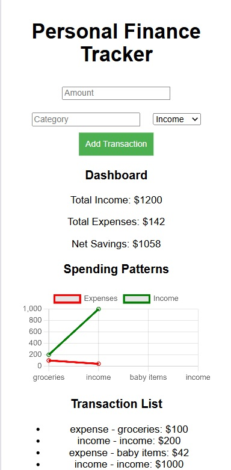

# Personal Finance Tracker



## Description

The **Personal Finance Tracker** is a simple web application built using **HTML**, **CSS**, and **JavaScript**. The app allows users to track their personal finances by logging and managing income and expenses. It offers a straightforward way to stay on top of your budget and track spending habits over time.

## Features

- **Add income and expenses**: Log your financial transactions to keep track of your budget.
- **Simple user interface**: Clean and easy-to-use layout built with HTML and CSS.
- **Interactive functionality**: JavaScript powers the app’s logic, allowing for seamless addition and subtraction of transactions.

## Screenshots


## Installation

To run the app locally, follow these steps:

1. Clone the repository:
   ```bash
   git clone https://github.com/SaraMohamedRagab/Personal-financeTrakerapp.git
